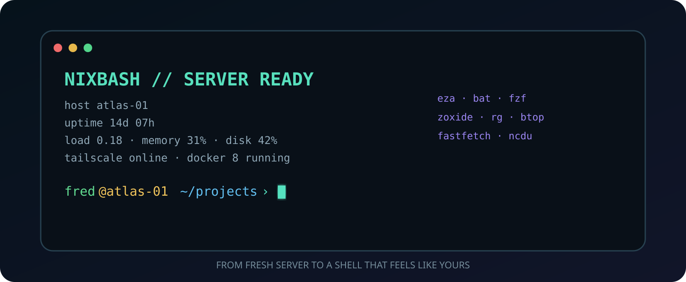
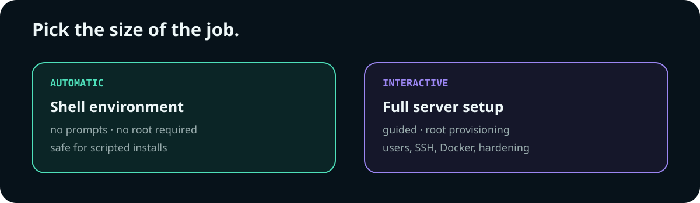
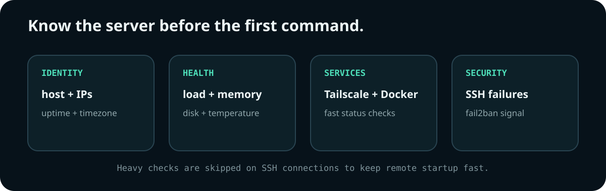
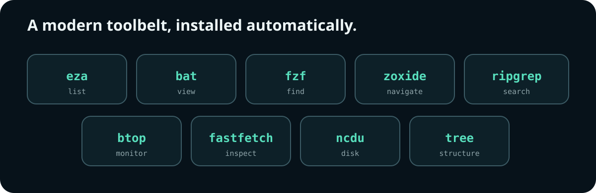
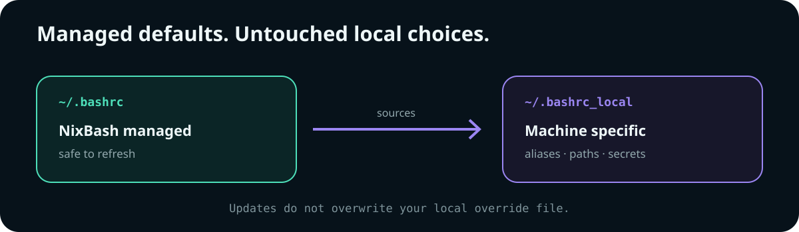

<div align="center">



# NixBash

### A fresh Linux server should feel finished in one command.

[](.bashrc)
[](#requirements)
[](LICENSE)

</div>

Fast, clean bash environment for Linux servers. One command to go from fresh install to fully provisioned.

## Install



**Automatic** -- shell environment only, no prompts, safe for scripted installs:

```bash
curl -sL https://raw.githubusercontent.com/nixfred/nixbash/main/install.sh | bash && source ~/.bashrc
```

**Interactive** -- full server provisioning with guided setup on apt-based systems (run as root):

```bash
curl -sL https://raw.githubusercontent.com/nixfred/nixbash/main/setup.sh | sudo bash
```

The interactive setup walks you through:
- Create a sudo user with NOPASSWD
- Set hostname and timezone
- Import SSH keys from GitHub or paste manually
- Install Docker, Claude Code, Tailscale
- Install essential tools (git, vim, tmux, nmap, rsync, fail2ban, etc.)
- Optionally install extras (monitoring, fun, security, hardware tools)
- Configure fail2ban, zram, unattended-upgrades
- Install NixBash shell environment (always included)

## What You Get

**System Banner** -- hostname, IPs (cached external IP), uptime, load, memory, disk, temp, Tailscale, Docker status, SSH fail attempts on every login. Heavy checks are skipped on SSH connections for fast remote shell startup.



**Prompt** -- `user@host ~/dir >` with colors (green user, yellow host, blue dir, cyan arrow)

**70+ Aliases and Functions** -- package management, navigation, file ops, git, monitoring, networking

**Modern CLI Tools** (auto-installed):


- `eza` -- better `ls` with icons
- `bat` -- better `cat` with syntax highlighting
- `fzf` -- fuzzy finder
- `zoxide` -- smart `cd` that learns
- `ripgrep` -- fast recursive search
- `htop` -- better `top`
- `btop` -- beautiful resource monitor (replaces top/htop/iotop in one TUI)
- `fastfetch` -- system info display (replaces neofetch)
- `ncdu` -- interactive disk usage analyzer
- `tree` -- directory visualization

**Functions:**
- `extract <file>` -- auto-detect and extract any archive (.tar.gz, .tar.xz, .xz, .zip, .7z, .rar, etc.)
- `mkcd <dir>` -- create directory and cd into it
- `cdd <dir>` -- cd and auto-list contents
- `listening <port>` -- show what process is using a port
- `push <local> <remote>` -- rsync push with progress
- `pull <remote>` -- rsync pull to current directory
- `psg <pattern>` -- find processes (excludes grep from results)
- `duh [path]` -- sorted disk usage summary
- `gitc [message]` -- git add all + commit (defaults to "WIP YYYY-MM-DD")
- `aa` -- full system update (apt, dnf, or pacman)
- `si <packages>` -- quick install with sudo detection (apt, dnf, or pacman)

## Alias Reference

| Alias | Command | Description |
|-------|---------|-------------|
| **Package Management** |||
| `aa` | `apt/dnf/pacman update flow` | Full system update (function) |
| `si` | `apt/dnf/pacman install` | Quick install (function) |
| **Navigation** |||
| `..` | `cd ..` | Up one |
| `...` | `cd ../..` | Up two |
| `....` | `cd ../../..` | Up three |
| `home` | `cd ~` | Home directory |
| **Files** |||
| `ll` | `ls -la` (or `eza -la`) | Detailed listing |
| `lt` | `ls -lat` (or `eza --tree`) | Tree/time sorted |
| `cls` | `clear && ls` | Clear and list |
| `mkp` | `mkdir -pv` | Make directory with parents |
| **Git** |||
| `gitc` | `git add -A && git commit -m` | Quick commit (function) |
| `gs` | `git status` | Status |
| `glog` | `git log --oneline --graph` | Pretty log |
| **Monitoring** |||
| `ports` | `netstat -tuln \|\| ss -tuln` | Open ports |
| `memtop` | `ps aux --sort=-%mem` | Top memory consumers |
| `cputop` | `ps aux --sort=-%cpu` | Top CPU consumers |
| `psg` | `ps aux \| grep (no self-match)` | Find process (function) |
| `duh` | `du -sh \| sort -h` | Disk usage (function) |
| `myip` | `curl ifconfig.me` | External IP |
| **Network** |||
| `ipa` | `ip a` | Show IP addresses |
| `ts` | `tailscale status` | Tailscale status |
| `tsip` | `tailscale ip -4` | Tailscale IPv4 |
| `pinglong` | `ping 1.1.1.1` (unlimited) | Continuous ping |
| `ff` | `find . -name` | Quick file search |
| **Productivity** |||
| `c` | `clear` | Clear screen |
| `e` | `exit` | Exit shell |
| `sb` | `source ~/.bashrc` | Reload config |
| `bm` | `nano ~/.bashrc && source` | Edit and reload |
| `h` | `history \| tail -20` | Recent history |
| `hg` | `history \| grep` | Search history |

## Local Overrides



Add machine-specific config (SSH aliases, API keys, custom paths) to:

```bash
~/.bashrc_local
```

This file is sourced automatically and won't be overwritten by NixBash updates.

## Suppress Banner

```bash
echo 'export NIXBASH_NO_BANNER=1' >> ~/.bashrc_local
```

## Uninstall

```bash
# Restore your original .bashrc
cp ~/.bashrc.pre-nixbash.* ~/.bashrc
source ~/.bashrc
```

## Requirements

- Linux with bash
- `curl` (for install)
- `apt`, `dnf`, or `pacman` (for tool installation)
- `install.sh` works on: Ubuntu, Debian, Raspberry Pi OS, Fedora, Arch, and derivatives
- `setup.sh` currently supports apt-based systems only

## License

MIT
